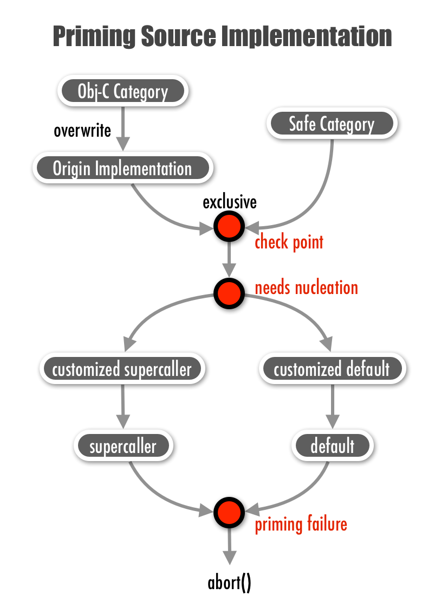

Documentation
=============

Be sure you've already read the [introduction] before this article.

 - [Aspect Field and Patch Field](#aspect-field-and-patch-field)
 	* [Aspect Namespace and Class Patch Field](#aspect-namespace-and-class-patch-field)
 	* [Aspect Encapsulation Conventions and Aspect File](#aspect-encapsulation-conventions-and-aspect-file)
 - [Patches](#patches)
	* [Aspect Patch](#aspect-patch)
	* [Safe Category Patch](#safe-category-patch)
	* [Nucleus Patch](#nucleus-patch)
 - [Downsides and Restrictions](#downsides-and-restrictions)


Aspect Field and Patch Field
----------------------------


### Aspect Namespace and Class Patch Field

An aspect field is a namespace to implement patches for the aspect. You create an aspect field by defining the macro keyword `AtAspect`:

```objc
#define AtAspect <#SpecificAspectName#>
```


XAspect macros use this defined keyword to synthesize many specific name. After this definition, you can start to create the class patch field:

```objc
#define AtAspectOfClass NSObject  // Define macro keyword for the target class
@classPatchField(NSObject)  // Create an implementation field for the target class

// Implement patches here.

@end
```


Macro `@classPatchField()` will create an implementation field just like `@implementation` does. Before `@classPatchField()`, you should also define a macro keyword `AtAspectOfClass`, and it should match the target class in the `@classPatchField()`.

The definition of both `AtAspect` and `AtAspectOfClass` are mandatory to create a valid class patch field. If you didn't define those two keywords correctly, the macro `@classPatchField()` will raise errors at compile-time or runtime.

You can create as many class patch fields in the same aspect namespace as possible you can. You also can create many aspect namespace to patch the same target class.

Between different `AtAspect` or `AtAspectOfClass`, you should undefine those keyword first:

```objc
#undef AtAspect
#undef AtAspectOfClass
```


If you create more than one class patch field with `@classPatchField()` which share the same aspect namespace (`AtAspect`) and the same target class (`AtAspectOfClass`), the compiler will raise a duplicated symbol error.

We recommend that you only create each aspect namespace only once. Patches for the same aspect should be encapsulated in one aspect namespace. We'll discuss how to encapsulate your aspect in one file.

> **Warning: Don't use Obj-C keyword `super` in any XAspect patch. The keyword `super` in patch field equals to the keyword `self`. You should use the macro `XAMessageForwardSuper()` instead. Please the section [Downsides and Restrictions].** 


### Aspect Encapsulation Conventions and Aspect File

Here are the conventions and tips for encapsulation:

 - Create a **.m** file for one aspect (or **.mm** for Objective-C++). Usually, you don't need a **.h** file to expose the interface.

 - Name the file as **'Aspect-<#AspectNamespace#>'**. The prefix **'Aspect-'** indicates this file is an aspect patch file for the specific aspect.

 - One aspect file should contain only one aspect; one aspect should be encapsulated in only one file.

 - Group aspect files together in Xcode project.

 - Try to write the aspect file as template first. Make sure it is highly reusable and maintainable, and then copy the file into your project. 
	* You may implement some features and comment them out in the template aspect file. Uncomment them when you need. 
	* Write comments in your template aspect file. Well documentation makes it easier to maintain.


Patches
-------

In the patch field, you could implement the following patches:

 - [Aspect Patch](#aspect-patch)
 - [Safe Category Patch](#safe-category-patch)
 - [Nucleus Patch](#nucleus-patch)

### Aspect Patch


Using aspect patches is easy. You use `AspectPatch()` macro to prefix the selector name for XAspect detecting. For example

```objc
AspectPatch(-, void, viewDidLoad)
{
	// Implement your aspect patch here.
}
```
	

In fact, XAspect will intercept the Obj-C message for your aspect patch by method swizzling. Usually, you'll need to forward the message to the source implementation by invoke `XAMessageForward()` with the method body and parameters.  You can add your logic code **before** and/or **after** invoke `XAMessageForward()`. These logic code is called [advice][advice]. You also need to return a value for the return type.

For example:


```objc
AspectPatch(-, BOOL, application:(UIApplication *)application didFinishLaunchingWithOptions:(NSDictionary *)launchOptions) 
{
	// Before advice
	
	BOOL retVal = XAMessageForward(application:(UIApplication *)application
								   didFinishLaunchingWithOptions:(NSDictionary *)launchOptions);
	// After advice
	
	return 	retVal;
}

```


A method could be patched by different aspect patches, and it will form a **selector chain**.

Aspect patches for the same target method should be independent to each other — and usually, it does. The weaving sequence for aspect patches is unknown.


### Safe Category Patch

Safe category is technique derived from [libextobjc] to avoid to overwriting the original implementation. It ensure that you will use this category implementation at runtime. If the original implementation exists or you implement more than two safe category for the same selector, XAspect will raise an error at loading time.

Using safe category in XAspect is simple — just like what you did in Obj-C category or libextobjc safe category:


```objc
#define AtAspect AnAspectName
#define AtAspectOfClass NSObject
@classForAspect(NSObject)

// After loading, instance of NSObject will respond to `-doSomething`.
- (void)doSomething
{
	// Implement your category patch here.
}

@end
#undef AtAspectOfClass
#undef AtAspect
```

If you're using [libextobjc] already, you'd better move those safe category methods to XAspect patch field to let XAspect control the injection sequence. 

You can invoke a safe category method in an aspect patch implementation if they are in the same class patch field. If they are not in the same class patch field, you should provide an interface for your safe category methods.


#### *Provide an interface for your safe category methods.

Safe category methods are private, and can be used directly in the same patch field. If you want to use the safe category outside of the class patch field, you need to provide the interface. Just simply use Obj-C category to expose the interface:


```objc
// Use the aspect name as the category name.
@interface NSObject (AnAspectName)
- (void)doSomething;
@end
```
	

### Nucleus Patch 

Before method swizzling for aspect patches, XAspect will check whether the target class does have the source implementation to exchange implementation. If the class doesn't have the implementation for method swizzling, XAspect will raise an assertion error at loading time.

To solve this, you need to add an implementation to the class before method swizzling. A way is using Objective-C category to inject an implementation, but it's not safe. This may overwrite the original implementation.

XAspect provides two solutions for this situation. One is **nucleus patch** (recommended); the other one is **safe category**. The following figure demonstrates how XAspect primes the source implementation.


<p align="center">
  
</p>

XAspect will try finding and injecting the proper nucleus patch implementation if needed. You can synthesize either *default* or *supercaller* nucleus patch by macro `@synthesizeNucleusPatch()`. For example, 

```objc
@synthesizeNucleusPatch(Default, -, void, doSomething);
@synthesizeNucleusPatch(SuperCaller, -, void, viewDidLoad);
```

 * **Default nucleus patch**: If the class itself and its superclasses don't respond to the selector, XAspect will try to find and use the default nucleus patch. A default nucleus patch is an implementation which will do nothing and return a null/zero value for the return type. 
 * **Supercaller nucleus patch**: If a superclass does respond to the selector but the class doesn't have its own implementation, XAspect will try to find and use the super-caller nucleus patch. A super-caller nucleus patch is an implementation which will simply invoke the superclass's implementation and return that value.

You can also customize the nucleus patches. We'll talk about in next section.

**Note: Although synthesizing nucleus patches has no effect when the target source implementation already exists, we still recommend you only synthesize those nuclei if needed.**


#### *Change the return value of the default nucleus patch (using customized default nucleus patch)

If you want to change the return value from the default implementation, you can use `@tryCustomizeDefaultPatch()` to customize the default behavior and return a new value. 

For example, you might want to synthesize a default implementation which will return `YES` for `-application:didFinishLaunchingWithOptions:` if it's not implemented in the project, you can implement like this:

```objc
@tryCustomizeDefaultPatch(1, -, BOOL, application:(UIApplication *)application didFinishLaunchingWithOptions:(NSDictionary *)launchOptions) {
	return YES;
}
```


`@tryCustomizeDefaultPatch()` takes one more parameter, **priority**, to compete the default nucleus patch. You can synthesize multiple customized default nucleus patches in different class patch fields. XAspect will choose the implementation with highest priority for the nucleation. By the way, the `priority` is an `unsign long` value, and nucleus patches synthesized by `@synthesizeNucleusPatch()` have the priority of `0`.

> Don't implement your aspect logic in the customized nucleus patches; just return a customized value. 


#### *Change the return value of the super-caller nucleus patch (using customized supercaller nucleus patch)

You rarely need to change the behavior or the return value of a super-caller nucleus patch. But if you want, you can use `@tryCustomizeSupercallerPatch()` to achieve this.


```objc
@tryCustomizeSupercallerPatch(1, -, void, viewDidLoad) {
	XAMessageForwardSuper(viewDidLoad); // invoke superclass's implementation.
}
```


In any patches, you should not use the keyword `super` to invoke the superclass's implementation in a class patch field. Always use `XAMessageForwardSuper()` instead, and you should only use `XAMessageForwardSuper()` in `@tryCustomizeSupercallerPatch()`.

By the way, to use `@tryCustomizeSupercallerPatch()`, you still need to synthesize the super-caller nucleus patch as the bridge via `@synthesizeNucleusPatch()`.
 

Downsides and Restrictions
-------------------------

 - Don't use Obj-C keyword `super` directly in any patch. The keyword `super` in patch field equals to the keyword `self`. Use macro `XAMessageForwardSuper()` to invoke the superclass's implementation. You also need to synthesize the supercaller nucleus patch.

 - If you use `@synthesizeNucleusPatch()` to synthesize a patch with return type `void *`, you should use the type `VoidPointer` instead. This is because that the null return value implementation (`_XANullReturnValueImplementation()`) will not handle type `void *` correctly. 

 - You should rename method manually: if you want to rename your method name, you can't use Xcode refactor instruction (**Xcode -> Edit -> Refactor -> Rename**). Instead, you should rename manually (Find and Replace... `cmd`+`shift`+`option`+`F`). You can still use refactor instruction to rename class name. 


<!--Links-->
[introduction]: Introduction_of_XAspect.md
[libextobjc]: https://github.com/jspahrsummers/libextobjc

[advice]: http://en.wikipedia.org/wiki/Advice_(programming)