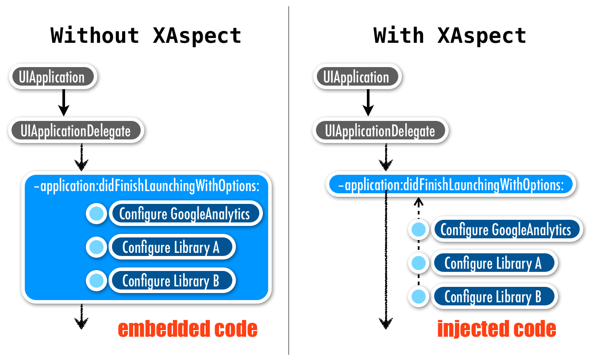

Introduction of XAspect
=======================

**[XAspect]** is one sub-project of my another project **[XSpect]** in 2013. After one year, I decide to release this improved version of XAspect independently.

In this article, we'll demonstrate what XAspect aims for and how to use XAspect:

 - [What is XAspect: the Aims of XAspect](#what-is-xaspect-the-aims-of-xaspect-)
	* [Decouple Implementation Dependency](#decouple-implementation-dependency)
	* [Encapsulate One Cross-Cutting Concern in One File](#encapsulate-one-cross-cutting-concern-in-one-file)
 - [How to Use XAspect: Getting Started](#how-to-use-xaspect-getting-started)
 	* [Basics of XAspect](#basics-of-xaspect)

You can find other articles here:

 - [Documentation][]: detailed information about how to use XAspect.


What is XAspect: the Aims of XAspect 
------------------------------------

### Decouple Implementation Dependency

XAspect decouples independent logic code from the target methods, encapsulate them outside of project source files, and inject them back into target methods at the program loading time.

For example, with XAspect, you can configure many libraries outside of `-application:didFinishLaunchingWithOptions:`. It keeps the source implementation clean and keeps [open-closed principle][OCP].





The following is likely what you do in your `-application:didFinishLaunchingWithOptions:` implementation without XAspect:


```objc
// AppDelegate.m
- (BOOL)application:(UIApplication *)application didFinishLaunchingWithOptions:(NSDictionary *)launchOptions 
{
	// (1) Initializing GoogleAnalytics library
	// Optional: automatically send uncaught exceptions to Google Analytics.
	[GAI sharedInstance].trackUncaughtExceptions = YES;

	// Optional: set Google Analytics dispatch interval to e.g. 20 seconds.
	[GAI sharedInstance].dispatchInterval = 20;

	// Optional: set Logger to VERBOSE for debug information.
	[[[GAI sharedInstance] logger] setLogLevel:kGAILogLevelVerbose];

	// Initialize tracker. Replace with your tracking ID.
	[[GAI sharedInstance] trackerWithTrackingId:@"UA-XXXX-Y"];


	// (2) Configure library A
	NSLog(@"Configure library A");
		...
		
	// (3) Configure library B
	NSLog(@"Configure library B");
		...
	
	// Other Configuration...
	
	return YES;
}
```


As time goes by, the implementation of `-application:didFinishLaunchingWithOptions:` will become bigger and more complex.

With XAspect, you'll implement `-application:didFinishLaunchingWithOptions:` like this:


```objc
// AppDelegate.m
- (BOOL)application:(UIApplication *)application didFinishLaunchingWithOptions:(NSDictionary *)launchOptions {
	return YES;
}
```


Yes, you just need to focus on the main responsibility of `-application:didFinishLaunchingWithOptions:` — return `YES` or `NO`. We'll  implement the independent aspects in different places.

Implement aspect ***GoogleAnalytics*** in *Aspect-GoogleAnalytics.m*:


```objc
// Aspect-GoogleAnalytics.m
#import "AppDelegate.h"
#import <XAspect/XAspect.h>

// Define an aspect field for GoogleAnalytics
#define AtAspect GoogleAnalytics 

#define AtAspectOfClass AppDelegate
@classPatchField(AppDelegate)
AspectPatch(-, BOOL, application:(UIApplication *)application didFinishLaunchingWithOptions:(NSDictionary *)launchOptions)
{
	 // Optional: automatically send uncaught exceptions to Google Analytics.
	[GAI sharedInstance].trackUncaughtExceptions = YES;

	// Optional: set Google Analytics dispatch interval to e.g. 20 seconds.
	[GAI sharedInstance].dispatchInterval = 20;

	// Optional: set Logger to VERBOSE for debug information.
	[[[GAI sharedInstance] logger] setLogLevel:kGAILogLevelVerbose];

	// Initialize tracker. Replace with your tracking ID.
	[[GAI sharedInstance] trackerWithTrackingId:@"UA-XXXX-Y"];
	
	return XAspectForwardMessageToOrigin(application:application didFinishLaunchingWithOptions:launchOptions);
}
@end
#undef AtAspectOfClass
#undef AtAspect
```


Implement aspect ***LibraryA*** in *Aspect-LibraryA.m*:


```objc
// Aspect-LibraryA.m
#import "AppDelegate.h"
#import <XAspect/XAspect.h>

// Define an aspect field for Library A
#define AtAspect LibraryA

#define AtAspectOfClass AppDelegate
@classPatchField(AppDelegate)
AspectPatch(-, BOOL, application:(UIApplication *)application didFinishLaunchingWithOptions:(NSDictionary *)launchOptions) 
{
	// Configure Library A here		
	NSLog(@"Configure library A");
}
@end
#undef AtAspectOfClass
#undef AtAspect
```
	

Implement aspect ***LibraryB*** in *Aspect-LibraryB.m*:


```objc
// Aspect-LibraryB.m	
#import "AppDelegate.h"
#import <XAspect/XAspect.h>

// Define an aspect field for Library B
#define AtAspect LibraryB

#define AtAspectOfClass AppDelegate
@classPatchField(AppDelegate)
AspectPatch(-, BOOL, application:(UIApplication *)application didFinishLaunchingWithOptions:(NSDictionary *)launchOptions)
{		
	// Configure Library B here		
	NSLog(@"Configure library B");
}
@end
#undef AtAspectOfClass
#undef AtAspect
```


XAspect will weave those **aspect patches** into `-application:didFinishLaunchingWithOptions:` when the program finishes loading. The results are equivalent to what you did without XAspect.

You may notice that for every time you want to add an aspect code to configure another library, you don't have to modify the original implementation of `-application:didFinishLaunchingWithOptions:`. You just need to implement an aspect patch using XAspect. That's [**"open for extension, and closed for modification."**][OCP]

You also may notice that the extracted configuration code is reusable. You can copy the configuration file (asepct file) to another project for the same configuration — or, reuse it with a little modification.

In this section, we demonstrate how to separate different aspect tasks from one class into different files. In the next section, we'll talk about how to encapsulate logic code for the same aspect in one file.


### Encapsulate One Cross-Cutting Concern in One File

After decoupling subtasks from implementation, encapsulation is easy. Just gather tasks (patches) with the same aspect in the same `XAspect` namespace in one file. You can patch multiple classes in one aspect file.

For example, You want to use **CocoaLumberjack** to log messages whenever a view controller did load its view and did display its view. You can configure the CocoaLumberjack library and use it in one aspect file.

The following sample code demonstrates how to achieve this goal. You can try either:

 * Find this sample code in *Aspect-CocoaLumberjack.m* in the *XAspectDev* project in the repository, or

 * Create an *Aspect-CocoaLumberjack.m* file in your project, and add the following code (You might also need to install [**CocoaLumberjack**][CocoaLumberjack] with version `2.0.0-beta2` and change the class `AppDelegate` in the demo code to yours in your project if needed):


```objc
// In Aspect-CocoaLumberjack.m
#import "AppDelegate.h"
#import <XAspect/XAspect.h>

// =============================================================================
#define AtAspect CocoaLumberjack
// =============================================================================
/**
 CocoaLumberjack
 
 @version 2.0.0-beta2
 @see https://github.com/CocoaLumberjack/CocoaLumberjack
 */

// We define the keyword `LOG_LEVEL_DEF` before importing CocoaLumberjack. We
// use this macro to indicate the level in this aspect file.
#ifdef DEBUG
	#define LOG_LEVEL_DEF LOG_LEVEL_VERBOSE
#else
	#define LOG_LEVEL_DEF LOG_LEVEL_WARN
#endif

#import <CocoaLumberjack/CocoaLumberjack.h>
// -----------------------------------------------------------------------------

#define AtAspectOfClass AppDelegate
@classPatchField(AppDelegate)

@tryCustomizeDefaultPatch(1, -, BOOL, application:(UIApplication *)application didFinishLaunchingWithOptions:(NSDictionary *)launchOptions){
	return YES;
}

AspectPatch(-, BOOL, application:(UIApplication *)application didFinishLaunchingWithOptions:(NSDictionary *)launchOptions) 
{
	[DDLog addLogger:[DDASLLogger sharedInstance]]; // sends log statements to Apple System Logger, so they show up on Console.app
	[DDLog addLogger:[DDTTYLogger sharedInstance]];	// sends log statements to Xcode console - if available
	
	DDLogInfo(@"CocoaLumberjack's Loggers have been configured when application did finish launching.");
	
	return XAMessageForward(application:(UIApplication *)application
							didFinishLaunchingWithOptions:(NSDictionary *)launchOptions);
}

@end
#undef AtAspectOfClass 

// -----------------------------------------------------------------------------

#define AtAspectOfClass UIViewController
@classPatchField(UIViewController)

@synthesizeNucleusPatch(Default, -, void, viewDidLoad);
@synthesizeNucleusPatch(Default, -, void, viewDidAppear:(BOOL)animated);

AspectPatch(-, void, viewDidLoad) 
{
	DDLogInfo(@"[CocoaLumberjack Log]: %@'s view did load.", NSStringFromClass([self class]));
	return XAMessageForward(viewDidLoad);
}

AspectPatch(-, void, viewDidAppear:(BOOL)animated) 
{	
	DDLogInfo(@"[CocoaLumberjack Log]: %@'s view did appear.", NSStringFromClass([self class]));
	return XAMessageForward(viewDidAppear:(BOOL)animated);
}

@end
#undef AtAspectOfClass
```


After running the program, You'll see the messages in the Xcode console:

	CocoaLumberjack's Loggers have been configured when application did finish launching.
	[CocoaLumberjack Log]: XAViewController's view did load.
	[CocoaLumberjack Log]: XAViewController's view did appear.


In this sample, we demonstrate how XAspect encapsulates one [cross-cutting concern] in one aspect file. Without aspect-oriented programming, you need to separate those code into several classes in different files. XAspect encapsulate one aspect in one file, which means that you don't have to change any existing code in your project. 


Now we'd like you try to do the following tasks to experience the power of XAspect:

 - Add more logging implementation using CocoaLumberjack in this aspect file for any target selector of any target class (like **target-action**). For more information how to use XAspect, please read the [documentation].

 - Copy the aspect file into another project. Try to reuse it with a little modification. At least, you can reuse the configuration code.

 - Remove CocoaLumberjack library from project, and use `NSLog()` instead. This shows how you can change using libraries/frameworks without modifying many files — you just need to change in one file.

 - Remove this aspect file from the project (or comment out all code in this file). You'll see you remove the multiple implementations through the classes in the project without modifying any source code.


How to Use XAspect: Getting Started
-----------------------------------

### Basics of XAspect

XAspect uses lots of C macros to create class patch fields for implementing your patch implementation. There are two kinds of macros:

 1. To create a class patch field to let you write your patches.
 2. To help you implement your patches.

The following is a simple example:


```objc
#import <UIKit/UIKit.h>
#import <XAspect/XAspect.h>

#define AtAspect SpecificAspectNamespace  // 1

#define AtAspectOfClass UIButton  // 2
@classPatchField(UIButton)  // 2

@synthesizeNucleusPatch(SuperCaller, -, instancetype, initWithFrame:(CGRect)frame); // 3

AspectPatch(-, instancetype, initWithFrame:(CGRect)frame) // 4
{  
	
	// 5. before advice
	
	UIButton *view = XAMessageForward(initWithFrame:frame); // 6
	
	// 7. after advice
	
	return (UIButton *)view; // 8
}

- (void)safeCategoryMethod {  // 9
	
}

@end  // Close `@classPatchField()` field
#undef AtAspectOfClass

#undef AtAspect
```


 1. **Define an aspect namespace**: Use `#define AtAspect <#AspectName#>` ... `#undef AtAspect` to create a namespace. XAspect macros will take the defined `AtAspect` in current context to synthesize unique identifiers for recognition. **The definition of `AtAspect` is mandatory**.

 2. **Create a class patch field for the target class**: Within an *aspect namespace*, use `@classPatchField()` ... `@end` to create a class patch field for implementing your patches of the target class. It's like Obj-C `@implementation` ... `@end` field. You also need to define the macro keyword `AtAspectOfClass` just above the `@classPatchField()` and the class name should match. Other XAspect macros will use both `AtAspect` and `AtAspectOfClass`.

 3. **Synthesize the nucleus if needed**: XAspect uses method swizzling to make the *selector chain*. The source implementation must exist before method swizzling. The macro `@synthesizeNucleusPatch()` will synthesize the implementation for you if the target class doesn't have its own source implementation. For more details, see ['Nucleus Patch'][Nucleus Patch] section in the documentation.

 4. **Declare an aspect patch for a target method**: Within the *aspect patch field*, use `AspectPatch()` macro to synthesize the aspect method signature for your aspect implementation. 

 5. **Implement before advice**: This is a place you could add your logic **before** invoking source implementation. It's also called [before advice][advice]. 

 6. **Forward to the source implementation**: Use `XAMessageForward()` macro to forward the message to the source implementation, and receive the return value. You can pass other parameters to the source implementation. If you don't forward the invocation, the source implementation will never be called. 

 7. **Implement after advice**: This is a place you could add your logic **after** invoking source implementation. It's also called [after advice][advice].

 8. **Return value**: Return a value for the method. Usually you return the value received from the source implementation. You can change the return value in the *after advice*.

 9. **Implement Category methods if needed**: Sometimes you also need to add category methods to the target class. XAspect already implements *Safe Category* feature. You can simply implement your category implementation here and XAspect will patch them for you. You can directly use those category methods in the aspect patch if they were existing in the same aspect field (`@classPatchField()`).


You can add more class patch fields in one aspect namespace. Just redefine `AtAspectOfClass` and use `@classPatchField` ... `@end` in the same aspect namespace to create another class patch field.

We recommend you implement one aspect in one file, and never define the same aspect namespace twice.

For more details, read the [documentation].


<!-- File Link -->
[XAspect]: ../README.md
[documentation]: Documentation.md
[Nucleus Patch]: Documentation.md
<!-- Web Link -->
[XSpect]: https://github.com/xareelee/XSpect
[SRP]: http://en.wikipedia.org/wiki/Single_responsibility_principle
[OCP]: http://en.wikipedia.org/wiki/Open/closed_principle
[cross-cutting concern]: http://en.wikipedia.org/wiki/Cross-cutting_concern
[CocoaLumberjack]: https://github.com/CocoaLumberjack/CocoaLumberjack
[advice]: http://en.wikipedia.org/wiki/Advice_(programming)
